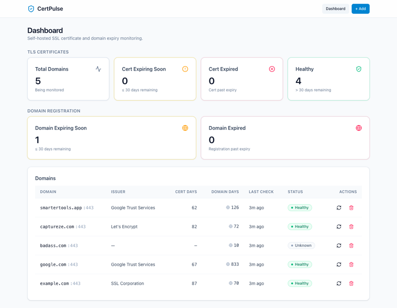

<div align="center">

# 🔔 SSLert

**Self-hosted SSL certificate & domain expiry monitor with multi-channel alerts.**

Let's Encrypt stopped expiry notifications on June 4, 2025.  
Cert lifetimes are shrinking to 47 days by 2029.  
SSLert fills the gap.

[](https://github.com/einperegrin/sslert/actions/workflows/ci.yml)
[](./LICENSE)
[](./docker-compose.yml)

[Quickstart](#-quickstart-docker) · [Auth](#-authentication) · [Channels](#-alert-channels) · [API](#-api) · [Config](#%EF%B8%8F-environment-variables) · [Develop](#-development)

</div>



---

## ✨ Features

- **SSL expiry monitoring** — checks certificates via `node:tls`, alerts at 30 / 7 / 1 days and on expiry
- **Domain registration expiry** — RDAP bootstrap + WHOIS fallback, same alert schedule
- **5 alert channels** — Email, Webhook, Telegram, Slack, ntfy — configure per domain
- **Self-hosted** — one `docker compose up`, data in SQLite, zero external dependencies
- **Prometheus metrics** — built-in `/metrics` endpoint with a ready-to-import Grafana dashboard
- **Backup & restore** — single `.tar.gz` archive with secret redaction

## 🚀 Quickstart (Docker)

```bash
cp .env.example .env
# Optional: set RESEND_API_KEY + ALERT_EMAIL_TO for email alerts
# Leave blank to log alerts to stdout instead

docker compose up --build
```

Open http://localhost:5173 for the dashboard.

### Create your first API token

All `/api/*` routes require a bearer token. Create one before you can add domains:

```bash
docker compose exec api npm run token:create -- --label "admin"
```

Copy the printed token — it's shown **only once**. Then open the dashboard, click **Settings**, and paste it into the token field.

Click **+ Add**, type a hostname, and the first SSL check fires immediately.  
From then on, checks run on a cron schedule (default: every 60 minutes).

## 🔐 Authentication

All `/api/*` routes require a bearer token, except `/health` (kept public for the docker healthcheck).

### Create a token

```bash
# from a running container
docker compose exec api npm run token:create -- --label "admin"

# or from inside packages/api if running locally
npm run token:create -- --label "admin"
```

The CLI prints the raw token **exactly once** — copy it immediately. The database only stores the SHA-256 hash; the raw token is unrecoverable.

### Use the token

```bash
curl -H "Authorization: Bearer <token>" http://localhost:5173/api/domains
```

### Manage tokens

```bash
npm run token:list               # show id, label, created, expires, last-used
npm run token:revoke -- --id 3   # delete by id
```

### Escape hatch (dev only)

Set `AUTH_DISABLED=1` in your `.env` for local dev to skip auth. **Never** set this in production — the entire API is open.

## 📡 Alert channels

Every domain can have any combination of channels. Missing config = silently skipped, failed channel = logged but doesn't block others.

| Channel | Free? | Setup |
|---------|-------|-------|
| **Email** | ✅ | Set `RESEND_API_KEY` + `ALERT_EMAIL_TO` |
| **Webhook** | ✅ | Any HTTPS endpoint; POST JSON payload |
| **Telegram** | ✅ | Bot token + chat ID via @BotFather |
| **Slack** | ✅ | Incoming Webhook URL |
| **ntfy** | ✅ | Pick a topic on https://ntfy.sh |

### Alert levels (cert & domain expiry)

| Days remaining | Level | Subject |
|---------------|-------|---------|
| > 30 | *none* | — |
| ≤ 30 | `warning` | Expires in 30 days |
| ≤ 7 | `urgent` | Expires in 7 days |
| ≤ 1 | `critical` | EXPIRES TOMORROW |
| ≤ 0 | `emergency` | CERTIFICATE / DOMAIN EXPIRED |

Dedup: at most one alert per (domain, source, channel, level) per 24 hours.

### Webhook payload

```json
{
  "source": "cert",
  "level": "urgent",
  "hostname": "example.com:443",
  "daysRemaining": 5,
  "subject": "[SSLert] example.com: Expires in 7 days",
  "text": "…"
}
```

## 🔌 API

Base URL: `http://localhost:5173` (through the nginx reverse proxy; the API itself is internal-only).

| Method | Path | Purpose |
|--------|------|---------|
| GET | `/health` | Liveness probe |
| GET | `/api/config` | Effective config (interval, hasResend, alert email) |
| GET | `/api/dashboard` | Counts + rows (cert + domain expiry, healthy, expired) |
| GET | `/api/domains` | List all monitored domains + latest check |
| POST | `/api/domains` | Add a domain; runs first check immediately |
| GET | `/api/domains/:id` | Domain detail with last 10 checks |
| DELETE | `/api/domains/:id` | Remove a domain (cascades) |
| POST | `/api/domains/:id/check` | Manual "Check Now" |
| GET | `/api/domains/:id/channels` | List alert channels for a domain |
| POST | `/api/domains/:id/channels` | Upsert a channel |
| PATCH | `/api/domains/:id/channels/:cid` | Update enabled flag / config |
| DELETE | `/api/domains/:id/channels/:cid` | Remove a channel |
| GET | `/api/checks?domain_id=X` | Recent checks (filtered) |
| GET | `/api/alerts` | Alert history (includes source + channel) |

### Example

```bash
curl -X POST http://localhost:5173/api/domains \
  -H 'Content-Type: application/json' \
  -H 'Authorization: Bearer <token>' \
  -d '{"hostname": "example.com"}'
```

## ⚙️ Environment variables

| Variable | Required | Default | Notes |
|----------|----------|---------|-------|
| `RESEND_API_KEY` | no | *empty* | If empty, alerts log to stdout |
| `ALERT_EMAIL_TO` | yes¹ | *empty* | Destination email |
| `ALERT_EMAIL_FROM` | no | `sslert@localhost` | Use a Resend-verified domain |
| `CHECK_INTERVAL` | no | `60` | Minutes between automatic checks |
| `DATABASE_PATH` | no | `/app/data/sslert.db` | SQLite file path |
| `PORT` | no | `3000` | API listen port (internal — not exposed to host) |
| `WEB_PORT` | no | `5173` | Host port for the nginx reverse proxy |
| `VITE_API_URL` | no | `http://localhost:3000` | Web → API URL (dev mode only) |
| `LOG_LEVEL` | no | `info` | pino log level: `trace` / `debug` / `info` / `warn` / `error` / `fatal` |
| `RATE_LIMIT_PER_MINUTE` | no | `100` | Per-IP rate limit on `/api/*` (health and metrics exempt) |
| `AUDIT_LOG_RETENTION_DAYS` | no | `90` | Audit log rows older than this are pruned daily |
| `AUTH_DISABLED` | no | *unset* | **DEV ONLY** — set to `1` to skip bearer-token auth. Never set in production. |
| `ALLOW_PRIVATE_HOSTS` | no | *unset* | **DEV ONLY** — allows loopback/private hostnames in domain and webhook URLs. Skip in production. |
| `ALLOW_NONSTANDARD_TLS_PORTS` | no | *unset* | Lets `POST /api/domains` accept ports other than 443/8443. |

¹ Required only for email alerts. Without `RESEND_API_KEY`, all alerts go to stdout.

## 📊 Monitoring with Grafana

The API exposes Prometheus metrics at `GET /metrics` (no auth — like `/health`). A ready-to-import Grafana dashboard is shipped in the repo at [`packages/api/grafana/sslert-dashboard.json`](./packages/api/grafana/sslert-dashboard.json).

### One-command deploy with Grafana + Prometheus

Add to your `docker-compose.yml` (or a sibling file):

```yaml
services:
  prometheus:
    image: prom/prometheus:v2.54.1
    volumes:
      - ./prometheus.yml:/etc/prometheus/prometheus.yml:ro
    ports: ["9090:9090"]
  grafana:
    image: grafana/grafana:11.2.0
    environment:
      - GF_SECURITY_ADMIN_PASSWORD=changeme
    ports: ["3001:3000"]   # 3000 is taken by the SSLert API
    depends_on: [prometheus]
```

Minimal `prometheus.yml`:

```yaml
scrape_configs:
  - job_name: sslert
    metrics_path: /metrics
    static_configs:
      - targets: ["api:3000"]   # inside docker compose
```

Then open `http://localhost:3001`, add Prometheus as a datasource (`http://prometheus:9090`), and import the JSON.

<details>
<summary><b>Metric reference</b> (click to expand)</summary>

All names below are exported by `prom-client` from `packages/api/src/lib/metrics.ts`:

| Metric | Type | Labels |
|--------|------|--------|
| `sslert_http_request_duration_seconds` | Histogram | `result`, `method` |
| `sslert_http_requests_total` | Counter | `method`, `path`, `status` |
| `sslert_checks_total` | Counter | `result` |
| `sslert_check_duration_seconds` | Histogram | — |
| `sslert_alerts_sent_total` | Counter | `channel`, `source`, `result` |
| `sslert_alert_send_duration_seconds` | Histogram | `channel` |
| `sslert_rate_limit_hits_total` | Counter | `path` |
| `sslert_audit_log_writes_total` | Counter | `action`, `resource_type` |
| `sslert_last_check_timestamp_seconds` | Gauge | — |
| `sslert_last_alert_timestamp_seconds` | Gauge | — |
| `sslert_domains_total` | Gauge | — |
| `sslert_tokens_total` | Gauge | — |
| `sslert_db_query_duration_seconds` | Histogram | `operation` |

Plus the full set of default Node.js process metrics (event-loop lag, GC, memory, fd count, …) from `prom-client`'s `collectDefaultMetrics()`.

</details>

## 💾 Backup & restore

Self-hosted data is the user's most important asset. A backup is a single `.tar.gz` containing the SQLite database, a redacted copy of `.env`, a `manifest.json`, and a one-liner `README.md` describing the restore command.

```bash
# from a running container
docker compose exec api npm run backup:create
# or from inside packages/api
npm run backup:create                    # writes ./sslert-backup-YYYYMMDD-HHMMSS.tar.gz
npm run backup:create -- /tmp/cp.tar.gz  # custom output path

# restore (asks for confirmation unless --yes)
npm run backup:restore -- /tmp/cp.tar.gz --yes
```

The restore command:

1. Reads `manifest.json` from the archive and prints what will be restored.
2. Backs up the live DB to `<db-path>.pre-restore` before overwriting it.
3. Drops a redacted `.env.restored` next to the configured `.env` path (existing `.env` is **never** overwritten silently — diff and merge manually).

Secret redaction: any variable ending in `_KEY`, `_SECRET`, `_TOKEN`, or `_PASSWORD` has its value replaced with `<redacted>` in the archived `.env`.

## 🛡️ Container hardening

The compose stack is locked down by default:

- **No host port on the API** — all traffic goes through nginx on `WEB_PORT`. Reach the API from the host with `docker compose exec api ...`.
- **Read-only root filesystem** on both services. The only writable path inside the API is `/app/data` (a named volume for SQLite).
- **`cap_drop: ALL`** + **`no-new-privileges:true`** — drop every Linux capability, refuse setuid escalation. The API adds back `CAP_CHOWN`, `CAP_SETUID`, `CAP_SETGID` so its entrypoint can repair the ownership of `/app/data` and drop to the unprivileged user. With no-new-privileges, those capabilities cannot be inherited by any child process.
- **Dedicated unprivileged user** (UID/GID 10001, no shell, no home).
- **Healthchecks** on both services.

## ⬆️ Upgrading

On every start, the entrypoint repairs the ownership of `/app/data` so volumes inherited from older images become writable automatically.

If you ever see `SqliteError: attempt to write a readonly database` in the API logs after an upgrade:

```bash
# Re-run the entrypoint's repair manually:
docker compose exec api chown -R 10001:10001 /app/data

# Or start clean (you will lose registered domains — re-add them afterwards):
docker compose down
docker volume rm sslert_sslert-data
docker compose up -d
```

## 🧪 Development

```bash
npm install          # workspace install (api + web)
npm run dev:api      # http://localhost:3000
npm run dev:web      # http://localhost:5173
npm test             # vitest in both packages
npm run typecheck    # tsc --noEmit in both packages
```

The web dev server proxies `/api/*` to `http://localhost:3000` by default. Override with `VITE_API_URL`.

## 🛠 Stack

| Layer | Tech |
|-------|------|
| API | Node 22 + [Hono](https://hono.dev/) + [better-sqlite3](https://github.com/WiseLibs/better-sqlite3) + [Drizzle ORM](https://orm.drizzle.team/) |
| Scheduler | [node-cron](https://github.com/node-cron/node-cron) |
| SSL check | `node:tls` (built-in, zero deps) |
| Domain expiry | RDAP bootstrap + plain TCP WHOIS (no extra deps) |
| Email | [Resend](https://resend.com/) (free tier: 100 emails/day) |
| Web | React 19 + Vite 6 + Tailwind 4 + [shadcn/ui](https://ui.shadcn.com/) + TanStack Query 5 |
| Storage | Single SQLite file via `sslert-data` Docker volume |

## 🗓 Roadmap

- [ ] Status page for monitored domains
- [ ] CT log monitoring (Certificate Transparency)
- [ ] Internal / PKI certificate support
- [ ] Alert silencing / maintenance windows
- [ ] Webhook retry with exponential backoff

## 🤝 Contributing

PRs welcome! Open an issue first to discuss what you'd like to change.

## License

Licensed under the [GNU Affero General Public License v3.0](./LICENSE).